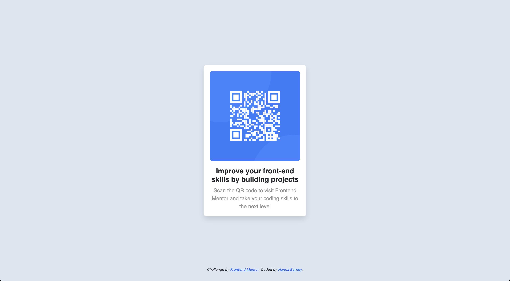

# Frontend Mentor - QR code component solution

This is a solution to the [QR code component challenge on Frontend Mentor](https://www.frontendmentor.io/challenges/qr-code-component-iux_sIO_H). Frontend Mentor challenges help you improve your coding skills by building realistic projects. 

## Table of contents

- [Overview](#overview)
  - [Screenshot](#screenshot)
  - [Links](#links)
  - [Built with](#built-with)
  - [What I learned](#what-i-learned)
  - [Continued development](#continued-development)
- [Author](#author)

## Overview

This is a simple project to create a display for a QR code.

### Screenshot

### Links

- Solution URL: [https://github.com/hanna-chez/QR-code---CSS-HTML)

### Built with

- Semantic HTML5 markup
- CSS custom properties
- Flexbox
- Bootstrap v5.3

### What I learned

This challenge provided a chance to get more familiar with Bootstrap and simple styling.

### Continued development

I'd like to implement Bootstrap with more custom syling on more complicated projects going forward.

## Author

- Website - [Hanna Barney](https://github.com/hanna-chez)
- Frontend Mentor - [hanna-chez](https://www.frontendmentor.io/profile/hanna-chez)
